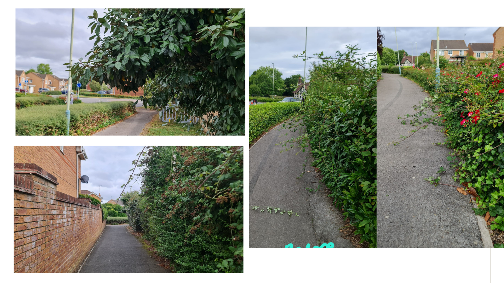

# Haydon Wick Parish Council- Obstruction of paths - low hanging branches (safety).


This case is currently active. We're awaiting the council's response.


***

**We next expect an update on this case by: 23 August.**

(Latest): Letter delivered by hand - 16 August

**Latest update (16th) -> letter hand delivered to Haydon Wick Parish Council Offices. I'm now awaiting their reply. As it was submitted on a Friday, there could be delays due to the weekend. I expect it to be looked at on Monday. The next follow up is the 23 August.**

Letter to be delivered today - 16 August

16/08/24 -> Letter to be hand delivered to Haydon Wick Parish Council **today**. Once it's been delivered, you'll see it here as latest update.&#x20;

Letter to be delivered tomorrow - 15 August

We're delivering the letter tomorrow.&#x20;

Letter completed: Ryan -> HWPC - 15 August

Re: Obstruction of paths by hanging and low-level branches – causing safety hazards.\
\
\
To whom this may concern,\
\
I am writing to request an improvement in service quality relating to the maintenance of hanging branches and low level shrubs around Haydon Wick Parish Council’s governing area, specifically between Gaynor Close and Tescos.\
\
Over the last year, members of the public have reported obstructions to the paths due to low hanging branches and overgrown shrubs/brambles, that not only limit walking space, but also cause hazards for those walking on them (therefore infringing on their rights to enjoy and use the paths). My neighbour is blind, and today a low hanging branch took his glasses off his face and left him with scratches across his head. This isn’t the first time this has happened, as he has already been cutting his legs on brambles that were sticking out above the path. If I wasn’t there at that specific time, he might have hurt himself badly (most likely requiring medical attention).\
\
After countless reports of this, I am now fed up with the lack of maintenance that is shown regarding this. This evening, I went out for two hours and cut back all the shrubs/brambles that were obstructing the path and causing massive safety hazards. See pictures attached. I ask that you reimburse me for the time spent.\
\
Not only is it a health and safety hazard, but you are also violating the Highways Act of 1980, specifically Section 130. These sections require local councils and parish’s to “protect the Public’s right to use these paths and protect their enjoyment”. Overgrown shrubs and branches are affecting my neighbour’s abilities to use the path  as it runs the risk of injury.\
\
In addition, the Equality Act of 2010 imposes a duty for you to make reasonable adjustments for people with disabilities (“The second requirement is a requirement, where a physical feature puts a disabled person at a substantial disadvantage in relation to a relevant matter in comparison with persons who are not disabled, to take such steps as it is reasonable to have to take to avoid the disadvantage.”). In this situation, you are required to:\
\
“(a) remove the physical feature in question,

(b) altering it, or

(c) providing a reasonable means of avoiding it.” – which there is none

\
Please note that if you fail to remove these obstacles in future or conduct checks (starting today) around your area looking for obstacles and they cause injury to me or my neighbour, I will seek legal action against you for the damages that arise from you not conducting your due diligence. In addition, if you fail to provide me with a reasonable conclusion to this case in a prompt manner, I will forward this complaint to:\
\
(a) – the Chairman of Swindon Borough Council (Jim Robbins),\
(b) – the LGO (Local Government and Social Care Ombudsman).\
\
\
\
I look forward to your prompt response to this matter.\
\
Yours sincerely,\
\
\
RI (not shown - case officer)\
\
\
\

Photo evidence uploaded - 15 August

 click on the image if it's too small

Case created and in draft - 15 August

Original Text (15th) -> my next door neighbour is blind, and today he cut himself on low hanging branches. The council have been reminded several times that there a blind person living their and about their duty of care, and making reasonable adjustments to those with disabilities. I went out and cut down the obstacles and have submitted a case to them.

***

### About this case:

My next door neighbour is blind, and today he cut himself on low hanging branches. The council have been reminded several times that there a blind person living their and about their duty of care, and making reasonable adjustments to those with disabilities. I went out and cut down the obstacles and have submitted a case to them. I have asked for compensation for my efforts.

\

