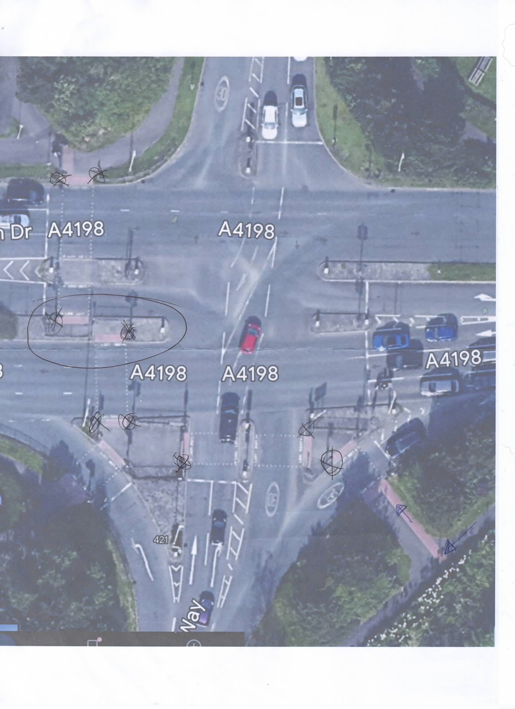

# Swindon Borough Council - faulty tactile cones


This case is currently active. We're awaiting the council's response.


**We next expect an update on this case by: 25 August.**

Latest: Our complaint is being investigated - 19 August

Our case status has changed to being investigated

Letter delivered via online form - 18 August

We've submitted our letter via the online form. The council have quoted 10 working days - however this is the longest timeframe.

Letter completed: Ryan -> SBC - 18 August

To whom this may concern,

I am writing to lodge a formal complaint regarding the upkeep of tactile cones across my area. Today, I conducted a check of all tactile cones on the A4198 Junction, leading to the Orbital, Toby Carvery, and the Blunsdon Arms.

On the 18 cones we tested, only 9 worked. Within this correspondence, I have attached a scanned copy of the A4198 Junction, and the faulty tactile cones are circled with an X.

The route was selected as my neighbour is blind, and he quite often (more than once a week) walks to Asda, the Toby and the Blunsdon Arms. He often has no one with him to help, and the other day he was stuck in the middle of the road (see circled area on scanned picture) and could not go back due to both side’s cones not working. He was stuck there until somebody kindly walked him across. There will not always be someone there to help.

As a council, it is your responsibility to be checking these cones and ensuring they are in good working order. I am submitting a complaint due to this reason.

Please note that under the Highways Act of 1980, you have a statutory duty to ensure roads and paths are maintained. In addition, under the E quality Act of 2010, you have a duty to make reasonable adjustments for those with disabilities.

I am asking that you fix these cones as quickly as possible, and monitor them in the future.

Yours sincerely,\
\
RI (not shown - lead case officer)

We've investigated them and are drafting a letter - 18 August

We found that 50% of cones did not work. We're currently drafting a letter to SBC. This will update soon.

Our findings have been uploaded - 18 August

A circled X means it's faulty.

We're investigating the reported faults - 18 August

We're currently out investigating the reported faults in the area reported.

Case created and in draft - 17 August

My next door neighbour is blind and relies on tactile cones when crossing busy roads. In a survey we conducted, we found that 50% of cones (9/18) were either faulty or did not work at all. We've contacted Swindon Borough Council and asked them to fix them and routinely monitor them for faults.

***

### About this case:

My next door neighbour is blind and relies on tactile cones when crossing busy roads. In a survey we conducted, we found that 50% of cones (9/18) were either faulty or did not work at all. We've contacted Swindon Borough Council and asked them to fix them and routinely monitor them for faults.\
\
Ref: WILTS-02
